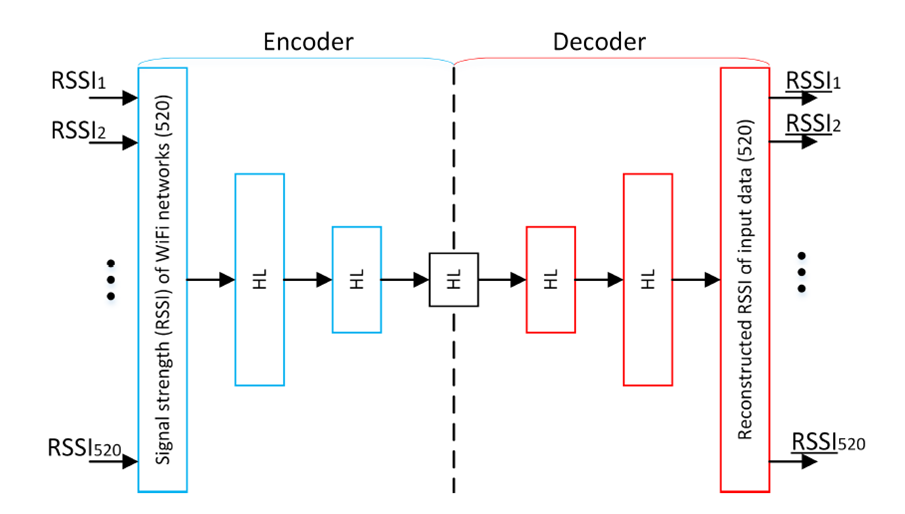
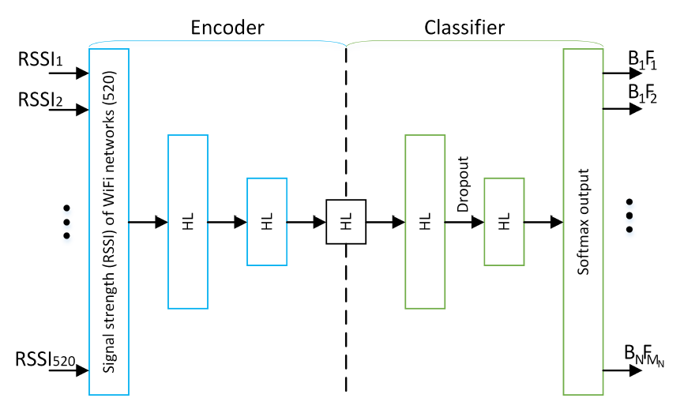
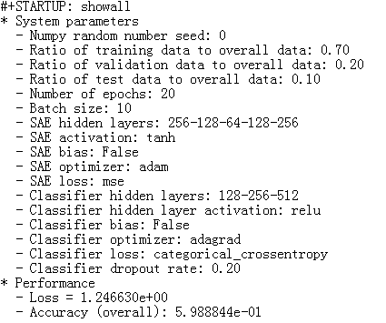
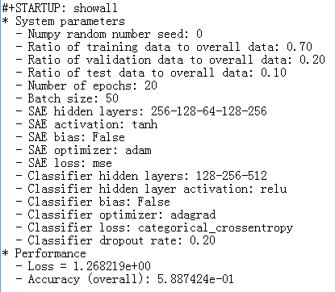
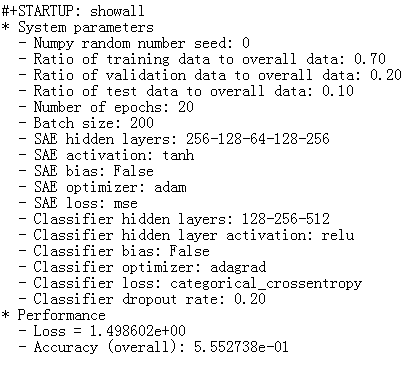
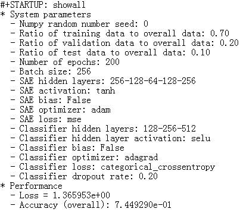
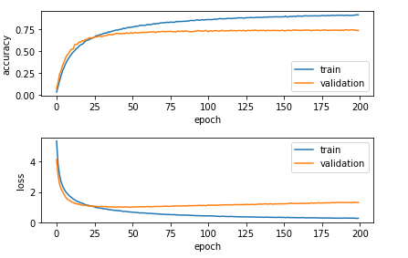
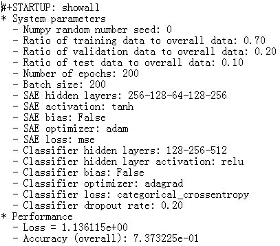
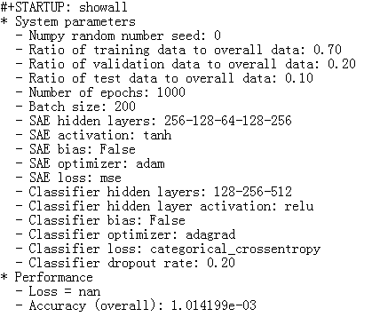
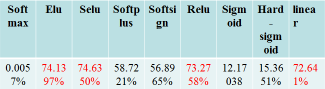

# **Floor Classification and Location Estimation using Wi-Fi Fingerprinting Based on Deep Neural Networks**
## **Content**
- Introduction
- Objective
- Methodology
- Analysis and discussion
- Conclusion

## **Introduction**
In an indoor environment where there is no line-of-sight signal from global positioning systems (GPSs), received signal strengths (RSSs) from wireless network infrastructure can be used for localization through fingerprinting: For example, a vector of a pair of a service set identifier (SSID) and an RSS for a Wi-Fi access point (AP) measured at a location becomes its location fingerprint. A position of a user/device then can be estimated by finding the closest match between its RSS measurement and the fingerprints of known locations in a database
### **Indoor Localization**
When indoor environment is unable to use satellite positioning, indoor positioning technology is used as an auxiliary location for satellite positioning, so that the problem of satellite signal arriving at the ground is weak and can not penetrate buildings.
### **Wi-Fi Indoor Localization**
When the indoor localization is to cover a large campus or a big shopping mall where there are lots of buildings with many floors, the scalability of fingerprinting techniques becomes an important issue. The current state-of-the-art Wi-Fi fingerprinting techniques assume a hierarchical approach to the indoor localization, where the building, floor, and position (e.g., a label or coordinates) of a location are estimated one at a time. 

## **Objective**
Understand the process of this assigenment and make some suggestion for improve the accuracy 

## **Methodology**
### **Stacked autoencoders (SAE) and DNN**
Stacked autoencoders (SAE) are parts of the deep network used to reduce the dimensionality of the input data by learning the reduced representation of the original data during unsupervised training.

As figure 1 shows the used SAE (blue) with additional decoder part (red) Stacked autoencoder (SAE) used in DNN to determine floor and building. The input to SAE are signal strengths detected in a scan with one value for each network visible in the training database. The output of decoder is the reconstructed input from reduced representation. The HL stands for hidden layer and the numbers in parentheses represent the number of neurons in the layer

:

**Figure 1** 

And figure 2 shows Architecture of DNN with SAE used to classify building and floor based on provided input WiFi scan. The already pre-trained encoder part is connected to classifier. The numbers in parentheses represent the number of neurons in the layer

:

**Figure 2**

## **Analysis and discussion**
### **Data Set**
For this assignment, the seventy percent is Training Set, the twenty set is Validation Set, and only one percent is Test Set. However, change the percentage of these three dataset just has only a little change for accuracy.

- Training Set

Training Set can optimize the model and change some parameters and so on. 

- Validation Set

Validation Set can select the best performing, approach using the Validation data, compare the algorithms and their parameters and decide on a best value. 

- Test Set

Do not change any parameters, it can test the following best model.

### **Batch Size**
Batch Size is important parameter for deep learning. The first key role of the batch selection is decide the descent direction. If the DataSet is relatively small, and then it is can use the Full Batch Learning. There are two advantages for this model. For one thing, the direction was decided by Full Batch Learning is better to represent the population that will point to the direction of extremum. For another, the different weights of gradient have different part, so it is difficult to choose a learning rate for whole situation, however Full Batch Learning can use the Resilient Propagation to solve this problem. For the big DataSet, the following advantages will become to disadvantages. For one thing, load the all data at once is not applicable gradually, which with the increasing number of DataSet and Memory Limit. Although it will also have some new problems when use the Resilient Propagation.

Moreover, if the Batch Size equals to one that means each circulation only train only one sample, and it named Online Learning, however in this assessment, actually, I think the number of Batch Size is a process for pretreatment, when Batch Size equals to one, the calculation of whole process is too slowly. 

The figure 3 shows the accuracy original file is equals closely to sixty percent. Firstly, I only changed the Batch Size equals to fifty, the accuracy changed to fifty eight percent that as shown in the figure 4. And then, I changed the Batch Size equals to two hundred, the accuracy will changed to that as shown in figure 5. Theoretically, increase the number of Batch Size within reasonable limits can increase the accuracy in a certain extent. However only change the number of Batch Size cannot increase the Batch Size that maybe will be decided by any other parameters. Moreover, if we promote the batch size blindly that will make some problems. Firstly, the lower memory capacity caused by the higher memory percent utilization, and then when the batch size increased a point, the descent direction will be not changed. 

:

**Figure 3** 

:

**Figure 4** 

:

**Figure 5** 

For the figure 6 and figure 7, it is a favorable results for improve the accuracy. 

:

**Figure 6** 

:

**Figure 7** 

### **Epochs**
The epoch is another parameter for deep learning. Total number of steps (batches of samples) before declaring one epoch finished and starting the next epoch. When training with input tensors such as TensorFlow data tensors, the default none is equal to the number of samples in your dataset divided by the batch size, or one if that cannot be determined. And then I try to change the number of epoch to two hundred and change the number of Batch Size to two hundred, because if only reduce the number of batch size not only that will make little sense but also it will running slowly. So look at this figure 8, the accuracy has been significantly improved, that means there are any relationship of two variates, and then I changed the Batch Size to one thousand, the result of it is very unsatisfactory that shown as this figure 9, the accuracy is too small.

:

**Figure 8** 

:

**Figure 9** 

### **Classifier layers**
For this layer, the original layers is 128-256-512, reduce the dimension ,whatever 128-256 or 256-512, it can  promote the accuracy. Although that is one of the way to promotion, however it is not logical. So there are some improvement should be improved.

### **Classifier activation**

For figure 10, compare the original we can see the accuracy of elu, selu, relu and linear has improve obviously 

:

**Figure 10** 

### **Classifier optimizer**
For this section,  there are also several function as same as ¡®adagrad¡¯, however there a little  changes for accuracy, so I am no longer continue to change it

### **Dropout**
The dropout is a specific value£¬ randomly drops connections between layers during training to force the net work to learn redundant representation and thus achieve better generalization and avoid overfitting.

## **Conclusion**
- Problems

There are several problems, which should be solved, the variable is so much that make a lot of changes. The relationship for each variable is too complex to define.

- Area for improvement

For this assignment, this is my first time to learn the how to improve the accuracy by deep learning, I think change the model can get the better solution.

## **Reference**
<a id="fn.1" class="footnum" href=" ">1</a > M. Nowicki and J. Wietrzykowski, "Low-effort place recognition with WiFi fingerprints using deep learning," arXiv:1611.02049v2 [cs.RO] [(arXiv)](https://arxiv.org/abs/1611.02049v2)

<a id="fn.2" class="footnum" href="#fnr.2">2</a > T. Yamashita et al., "Cost-alleviative learning for deep convolutional neural network-based facial part labeling," *IPSJ Transactions on Computer Vision and Applications*, vol. 7, pp. 99-103, 2015. [(DOI)](http://doi.org/10.2197/ipsjtcva.7.99)
